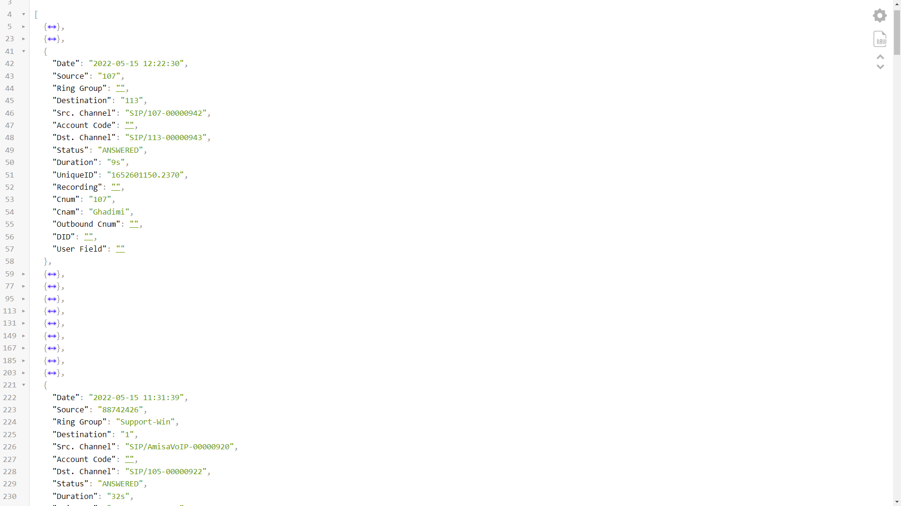
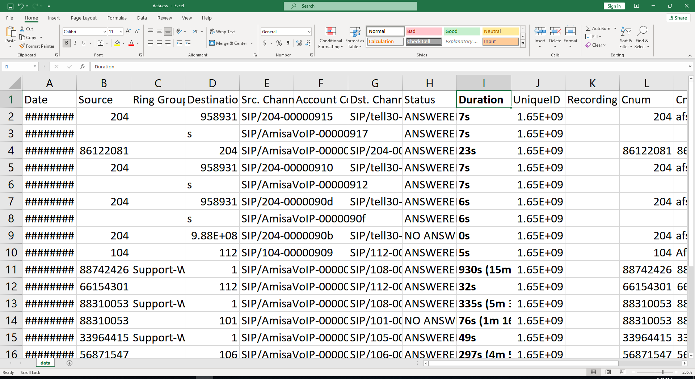

# Issabel Web-service PHP

### ISSABEL simple API Restful JSON

Provide call history reports from **Issabel** for a Call center powered by **PHP** with a **JSON web-service** interface

**This Restful can show all in-come and out-come calls with details about duration, sender and receiver number, etc.**

## Using

```sh
$ php index.php
$ php api.php
```





### Story of this repository

> I traveled to Tehran alone for the first time and visited an **IT company** there.
>
> It was the first time I came to that company, They said to me they have a problem with their **telephones** at their office.
>
> They want a program to report all telephone **call history** and save it in **JSON** as a web service.
>
> So I designed a script and a hack on top of **Issabel** to get the result from Issabel.
>
> I solved the problem in 20min. **Engineers** can solve any kind of problem by thinking, developing, and running.
>
> P.S: The better solution is to get data directly from Issabel's database, not a hack and dependency on cookie/session.

© Copyright by Max Base, 2022
